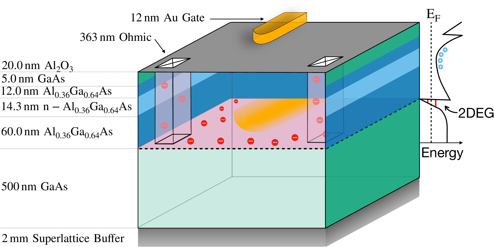
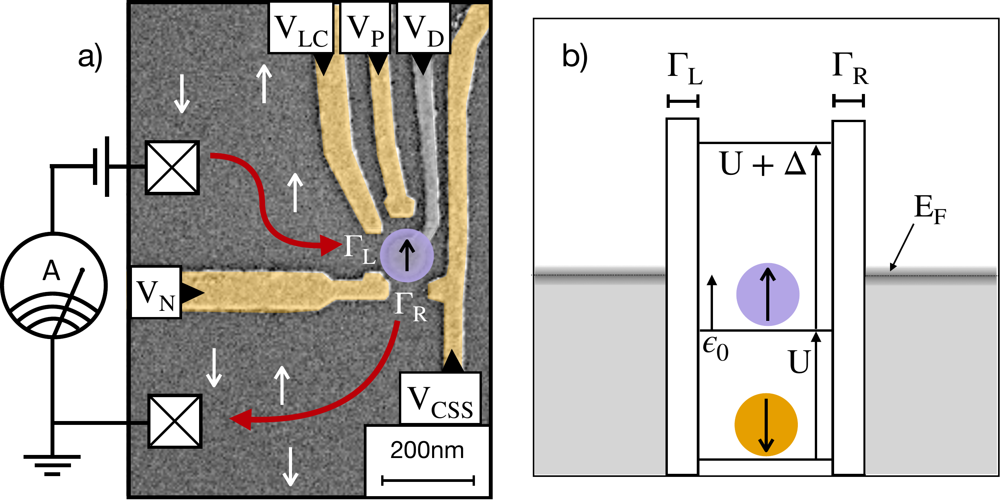
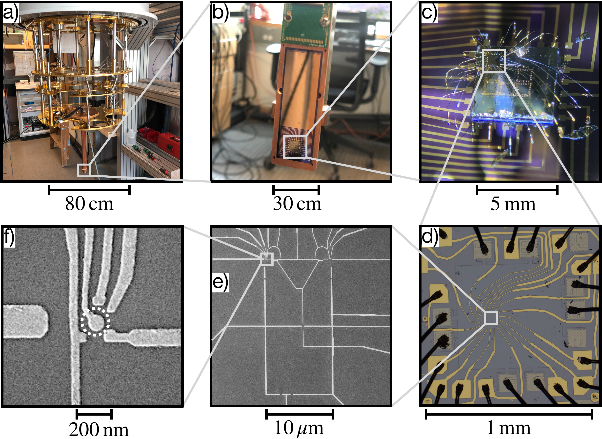
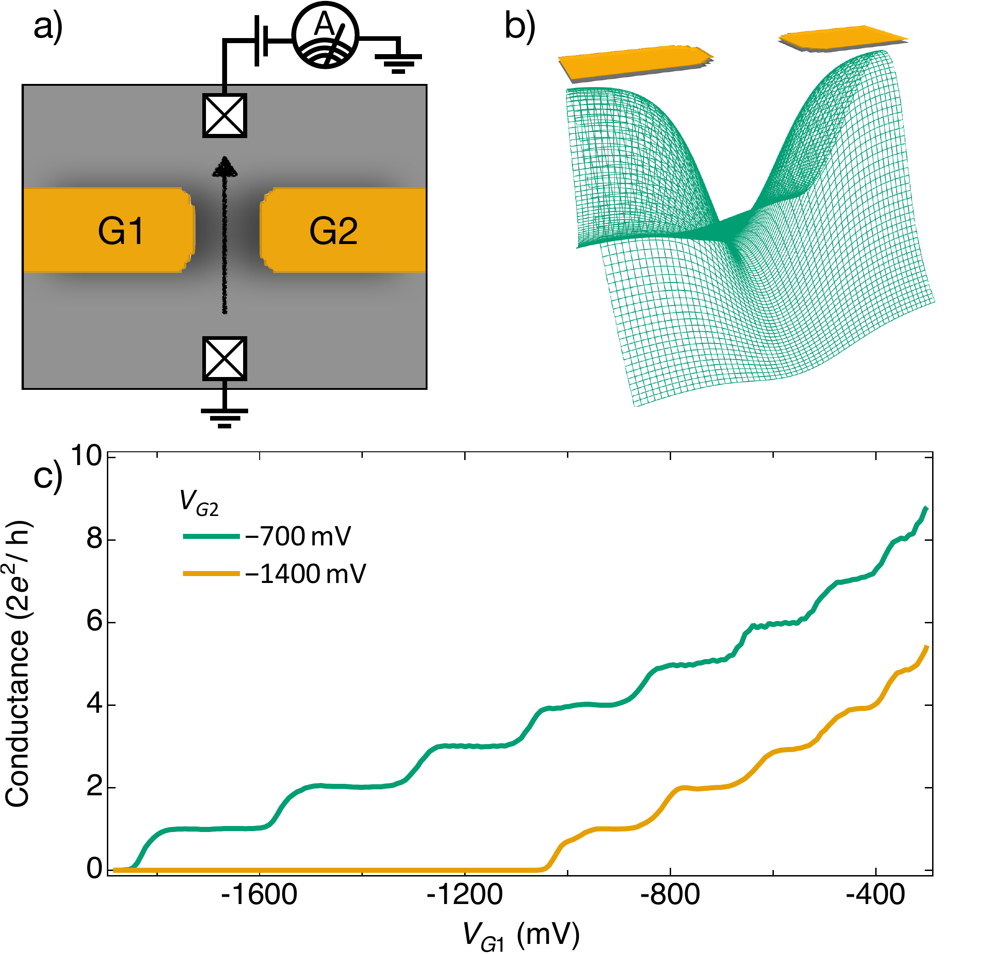

 # QDEV_masters_thesis
 A standalone repository which includes the data and code used to build the figures, and .tex files to create the thesis. 
 
The .pdf is included but here is a link to the [published thesis](https://open.library.ubc.ca/soa/cIRcle/collections/ubctheses/24/items/1.0441986) in UBC's online repository.


### Workflow
**LaTeX** was written in [Overleaf](https://www.overleaf.com) using the [UBC thesis template](https://www.overleaf.com/latex/templates/university-of-british-columbia-thesis-template/rnqmyghyfvvp).

Commits were pushed to the repo with the command ```git pull overleaf master --allow-unrelated-histories --rebase=falsez```.

**Plots** were made in **IGOR** and then organised in **Keynote**. 

The Keynote was saved as a .pdf and automatically cropped with [pdfresizer](https://pdfresizer.com) and then split with [smallpdf](
https://smallpdf.com).


### Notes
- I used a tool from DavidMathLogic to ensure my colour palette for categorical variables was [colour blind compatible](https://davidmathlogic.com/colorblind/#%23000000-%23E69F00-%2356B4E9-%23009E73-%23F0E442-%230072B2-%23D55E00-%23CC79A7)
- For continuous variables I used [Kenneth Mooreland's blog](https://www.kennethmoreland.com/color-advice/#fast!) to determine a palette. 


---

---

## Pretty Pictures
Here are a few pretty pictures to get you interested in reading the thesis. :) 


| GaAs/AlGaAs Heterostructure |  Quantum Dot Energy Levels  |
|---------|---------|
|  |  |
|Illustration of a GaAs/AlGaAs heterostructure. At the boundary between GaAs and AlGaAs, a two-dimensional electron gas (2DEG) is formed. A 2DEG can be thought of as a two-dimensional plane of electrons that can move freely along the x and y directions but are tightly confined in the z-direction. Ohmic contacts are made by annealing Ni-Au-Ge; the metal diffuses through the heterostructure, making contact with the 2DEG. Ohmic contacts are used to measure conductance through the 2DEG. Voltages are applied to gates to control the potential in the 2DEG, forming quantum point contacts (QPCs) or quantum dots. A negative (positive) voltage on the gate repels (attracts) the electrons.|(a) SEM image of the gates used to define a quantum dot. The gold-coloured gates indicate sufficient negative potential is applied such that the 2DEG below is depleted. The gates V_P  or V_D have the largest effect on dot energy ε0 without changing other energies. The crossed squares are ohmic contacts which contact the 2DEG. A small bias applied to the ohmic contacts allows conductance through the quantum dot to be mea- sured. (b) Coulomb blockade energy diagram showing discrete energy levels in the quantum dot and continuous energy levels in the leads. The grey boxes represent continuous energy levels of the electrons in the leads. The white rectangles represent tunnel barriers into and out of the quantum dot. The tunnelling rate is denoted by the parameter Γ; the wider (narrower) the barrier, the smaller (larger) the tunnelling rate. The orange circle represents the first electron in the quantum dot with spin down. The second electron (purple) will pair with the first spin-down electron, so the energy required to add the second electron is only the charging energy U. To add the third electron (not currently in the quantum dot), the charging energy U, plus the orbital level spacing energy ∆, is required.|


| Fridge to Quantum Dot Scale Illustration |  Quantum Point Contact  |
|---------|---------|
|  |  |
|(a) Photograph of the Au-plated cold plates within a dilution refrigerator. The lowest plate, known as the mixing chamber, can reach temperatures of 8 mK. (b) Photograph of the Si chip carrier, onto which the heterostructure is attached. (c) An optical microscope image shows the heterostructure attached to the chip carrier. Thin Al wire bonds connect the quantum device to the fridge wires. (d) Optical microscope image of a single mesa on the heterostructure. A mesa is an isolated area of the heterostructure where new designs are fabricated. The black lines around the outside are wire bonds and the bright Au are thick (100 nm) ‘outer gates’ which connect to thin (10 nm) ‘inner gates’. (e) Scanning electron micrograph (SEM) of the inner gates. The mean free path of the electrons is of order 3 μm. (f ) SEM image of the quantum dot. An isolated puddle of electrons with a total occupation between 0 and 10 is engineered by carefully tuning the voltages on the inner gates.|(a) Graphic representation from a top-down view of a quantum point contact (QPC). The gold fingers are the metallic gates to which negative voltages can be applied. The grey is where the electrons in the 2DEG can go, depending on the negative voltage applied to the gates. The crossed squares are ohmic contacts to the 2DEG. These contacts allow a bias across the QPC to be applied, so a conductance through the QPC can be measured. (b) Simulation of the electric potential the electrons see in the 2DEG due to the negative voltage applied to the gates. With sufficient negative voltages applied to the gates, the electrons cannot overcome the potential barrier under the gate and flow between the gates. (c) Measurement shows the quantised conductance through a QPC as the voltage on G1 becomes more negative. At sufficiently negative voltages, the potential barrier between the gates is large enough that a measurement will not record any tunnelling events, and the conductance is zero. The pinch-off is shifted from a more negative (green) to a less negative (yellow) value by increasing the negative voltage applied to G2.|


---

---


 ## Lay Abstract

>The Kondo effect, a phenomenon originally observed in impure metals decades ago, has been studied more recently in quantum devices. 
 These devices offer precise control to test theoretical predictions. 
 In these devices, a single electron on an isolated island is connected to a bath of electrons on each side.
 Previous studies have measured the conductance through the island as a single electron is added and observed a large increase in conductance as the system's temperature was lowered. 
 These experiments used a small barrier between the island and surrounding electrons. 
 In our experiment, we used a large barrier, resulting in an increase in conductance that was too small to measure with previous methods.
 To measure this small increase in conductance, we also measure the island's occupation as a single electron is added. 
 When the barriers to the island are symmetric, we find agreement with theory, and surprising disagreement when asymmetric. 

 ## Abstract

> The Kondo effect, first discovered in impure bulk metals during the 1930s and explained in the 1960s, has gained significant interest within the field of quantum devices. 
These devices offer a high degree of tunability and control, enabling rigorous testing of theoretical predictions.
Previous studies on the Kondo effect have measured conductance through a quantum dot and observed a zero-bias peak between Coulomb peaks. 
This effect requires strong coupling between the quantum dot and leads.
This work studies a relatively weak coupling, where the characteristic zero-bias peak between Coulomb peaks is not observed. However, as charge degeneracy of the quantum dot is approached, the Kondo temperature increases. This results in a small conductance enhancement at the shoulder of the Coulomb peak. 
We show that a simultaneous measurement of the quantum dot's occupation can unveil the small enhancement of conductance due to the Kondo effect. 
To compare with Numerical Renormalisation Group (NRG) theory, conductance and occupation are measured across a range of temperatures to determine fitting parameters.
Good agreement is found at a range of coupling strengths and charge sensor current setpoints.
However, a discrepancy is found when the tunnel barriers to the quantum dot are asymmetrically tuned. 
Strong asymmetric coupling approaches a regime where the quantum dot is coupled to a single lead. 
A recent measurement of the entropy of a quantum dot coupled to a single lead where Kondo correlations were expected also observed a discrepancy between data and NRG. 
Interestingly, this work shows that conductance data displays greater Kondo enhancement than NRG, whereas previously measured entropy showed less Kondo enhancement than NRG. 
A direct comparison of conductance and entropy measured in the same device under similar settings holds promise for illuminating this discrepancy.

